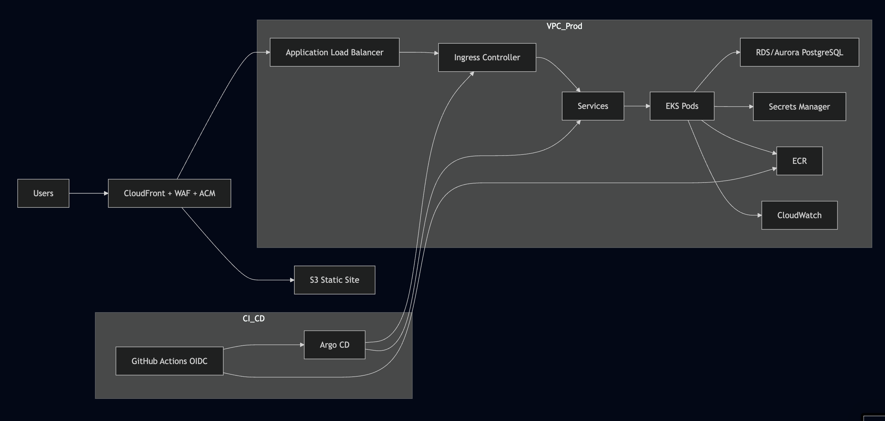

# Cloud Infrastructure – Innovate Inc

## Overview

This project provisions an AWS EKS cluster with autoscaling via Karpenter, Graviton support, and secure network architecture.

Innovate Inc. is building a web application that includes:

- A REST API backend built with Python (Flask)
- A Single Page Application (SPA) frontend built with React
- A PostgreSQL database

The app will initially serve a few hundred users per day but is expected to scale to millions. It handles sensitive user data, so strong security is a must. The team also plans to adopt CI/CD practices from day one.

The architecture diagram is in the project root: `eksArch.png`

---

## AWS Account Structure

We use four AWS accounts under an AWS Organization:

- Management – billing, policies (SCPs), and centralized IAM
- Dev – development and feature testing
- Staging – mirrors production for full validation
- Prod – live production workloads

This setup ensures environment isolation, improves security, and simplifies permission and cost tracking.

---

## CI/CD with GitOps

- GitHub Actions is used to build, test, and deploy both frontend and backend code
- Argo CD runs in the EKS cluster (prod) and handles continuous delivery using GitOps

### GitOps Flow

Developer pushes code to GitHub → GitHub Actions builds Docker image → Pushes image to ECR → Updates image tag in deployment YAML (in Git) → Git commit triggers Argo CD → Argo CD compares desired vs. live state → Argo CD applies new deployment to EKS

---

## VPC and Networking

Each environment (dev, staging, prod) has its own VPC with:

- Public and private subnets in three AZs
- NAT Gateway (one per environment)
- Internet Gateway for public traffic
- Private subnets for workloads and databases
- VPC endpoints for services like S3, ECR, and Secrets Manager

CloudFront and AWS WAF protect inbound traffic. Security Groups limit access by protocol and port.

---

## Compute – Amazon EKS

Each environment includes a separate EKS cluster running in private subnets.

- Ingress is handled via AWS ALB Ingress Controller
- Karpenter handles auto-scaling of nodes for application workloads (Spot instances for cost savings)

---

## Containerization and Deployment

### Backend

- Code is built with GitHub Actions and pushed to ECR
- Deployed to EKS through Argo CD using GitOps

### Frontend (React SPA)

- The React frontend is automatically built using GitHub Actions, then uploaded to an S3 bucket.
It is served as a static website via CloudFront, with cache invalidation to ensure users always get the latest version.

---

## Secrets and Config Management

- Non-sensitive configs use Kubernetes ConfigMaps
- Sensitive data is stored in AWS Secrets Manager
- Secrets are injected into pods securely via the yaml configuration. 

---

## Database – PostgreSQL

We use Aurora PostgreSQL Serverless v2 for all environments.

### Why Aurora Serverless v2

- Scales automatically based on traffic
- Fully managed and cost-efficient
- Multi-AZ failover and TLS enforced
- KMS encryption and Secrets Manager integration

### Backups and Disaster Recovery

- Backups are managed via AWS Backup (for infrastructure) and Velero (for Kubernetes workloads)
- Point-in-time recovery (PITR) is enabled for databases
- Cross-region snapshot replication supports disaster recovery
- Weekly manual snapshots can be added for compliance needs (optional)

---

## Monitoring and Logging

- CloudWatch Container Insights enabled for EKS clusters
- Application logs collected via Fluent Bit and sent to CloudWatch
- EKS control plane logging enabled
- Alarms set up on CPU, memory, and error rates

---

## Security Highlights

- AWS WAF protects against web-based attacks
- TLS enforced end-to-end (CloudFront → ALB → Pods)
- EKS nodes deployed in private subnets only
- Secrets never hardcoded – managed in Secrets Manager
- KMS used for encrypting S3, Aurora, and EBS volumes
- Internal traffic to AWS services (e.g. S3, ECR, Secrets Manager) is routed via VPC Endpoints to avoid public exposure.

---

## Cost Optimization

- Spot instances used for app workloads (via Karpenter)
- Aurora Serverless v2 reduces DB costs at scale
- Single NAT Gateway per VPC to cut networking costs
- VPC Endpoints avoid NAT charges for AWS service access

---